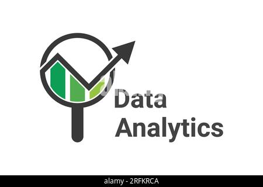

# 📊 50 Kaggle Datasets for Data Analysis Projects  

Welcome! Below is a **curated list of 50 Kaggle datasets** specifically selected for hands-on **Data Analysis projects**. These datasets are ideal if you're focusing on:  

- ✅ Data Cleaning  
- ✅ Exploratory Data Analysis (EDA)  
- ✅ Data Visualization  

The focus here is not on predictive modeling but on drawing meaningful insights through charts, summaries, and visual storytelling using tools like **Pandas, Seaborn, and Matplotlib**.

---

> 💡 *"Before building models, understand your data first."*

### Why This List?  
These datasets are:  
- Rich, messy, or multi-faceted  
- Perfect for portfolio-building and practice  
- Covering domains like retail, healthcare, sports, finance, and entertainment  

---

## ✅ Full List Below  
*Scroll down to explore all 50 datasets with objectives, links, and applicable data analysis concepts!*

### Category 1: Business & Finance
These datasets mimic real-world business problems, focusing on sales, customers, and financial outcomes.

1.  **Brazilian E-Commerce by Olist**
    *   **Link:** [Link to Dataset](https://www.kaggle.com/datasets/olistbr/brazilian-ecommerce)
    *   **Analysis Focus:** A fantastic multi-table dataset. Practice merging customer, order, payment, and product data to analyze the entire customer journey, identify top-selling products, and assess delivery performance.

2.  **Superstore Sales Dataset**
    *   **Link:** [Superstore Sales Dataset](https://www.kaggle.com/datasets/vivek468/superstore-dataset-final)
    *   **Analysis Focus:** A classic business intelligence dataset. Analyze sales and profit by region, product category, and customer segment. Practice creating KPIs and time-series visualizations of sales trends.

3.  **Online Retail II UCI**
    *   **Link:** [Link to Dataset](https://www.kaggle.com/datasets/mashlyn/online-retail-ii-uci)
    *   **Analysis Focus:** A messy, real-world transactional dataset. Practice intensive data cleaning (handling returns, missing `CustomerID`), and perform cohort analysis or RFM (Recency, Frequency, Monetary) segmentation.

4.  **Hotel Booking Demand**
    *   **Link:** [Link to Dataset](https://www.kaggle.com/datasets/jessemostipak/hotel-booking-demand)
    *   **Analysis Focus:** Analyze booking patterns to understand the drivers of cancellations. Explore seasonality, lead time, and customer type to provide insights for a hotel's revenue management strategy.

5.  **Customer Personality Analysis**
    *   **Link:** [Link to Dataset](https://www.kaggle.com/datasets/imakash3011/customer-personality-analysis)
    *   **Analysis Focus:** A great dataset for customer segmentation. Explore demographic and behavioral data to define distinct customer personas for targeted marketing.

6.  **Data Science & STEM Salaries**
    *   ✅ **Link:** [Data Science Job Salaries](https://www.kaggle.com/datasets/ruchi798/data-science-job-salaries)
    *   **Analysis Focus:** Clean messy job titles and salary fields. Explore how factors like experience level, employment type, company size, and location influence salary. Great dataset for practicing data cleaning, grouping and aggregation, and visualizing                 distributions or trends.

7.  **Used Cars Price Prediction**
    *   **Link:** [Link to Dataset](https://www.kaggle.com/datasets/avikasliwal/used-cars-price-prediction)
    *   **Analysis Focus:** This dataset requires significant cleaning of text and numerical columns (e.g., `Mileage`, `Engine`). Analyze the Indian used car market to find what features most influence car valuation.

8. **Fortune 500 Companies (2022)**
   * ✅ **Link:** [Fortune 500 Companies](https://www.kaggle.com/datasets/rm1000/fortune-500-companies)
   * **Analysis Focus:** Analyze the landscape of America's top companies from 1996–2023. Investigate revenue, profit, and employee counts by industry, state, and year. Visualize geographic concentration of corporate headquarters.
     
### Category 2: Social & Demographic
Datasets about people, society, health, and global trends that tell compelling stories.

9.  **World Happiness Report (up to 2023)**
    *   **Link:** [Link to Dataset](https://www.kaggle.com/datasets/ajaypalsinghlo/world-happiness-report-2023)
    *   **Analysis Focus:** Combine and analyze yearly reports to visualize how happiness scores have changed globally. Explore the relationship between happiness and factors like GDP, life expectancy, and social support.

10. **Global Terrorism Database (GTD)**
    *   **Link:** [Link to Dataset](https://www.kaggle.com/datasets/START-UMD/gtd)
    *   **Analysis Focus:** A massive and complex dataset perfect for a deep-dive analysis project. Clean numerous columns to analyze trends in terrorist attacks by region, weapon type, and target over several decades.

11. **Suicide Rates Overview (1985 to 2016)**
    *   **Link:** [Link to Dataset](https://www.kaggle.com/datasets/russellyates88/suicide-rates-overview-1985-to-2016)
    *   **Analysis Focus:** Aggregate and analyze data to compare suicide rates across countries, generations, and genders. Visualize long-term trends and demographic patterns.

12. **World University Rankings**
    *   **Link:** [Link to Dataset](https://www.kaggle.com/datasets/mylesoneill/world-university-rankings)
    *   **Analysis Focus:** Clean and merge data from different ranking systems. Analyze the performance of universities by country, and explore the correlation between metrics like student-staff ratio and ranking.

13. **Medical Cost Personal Datasets**
    *   **Link:** [Link to Dataset](https://www.kaggle.com/datasets/mirichoi0218/insurance)
    *   **Analysis Focus:** A perfect dataset for fundamental EDA. Explore how personal attributes (age, BMI, smoking status) correlate with medical insurance charges through visualizations and group-by analysis.

14. **Stroke Prediction Dataset**
    *   **Link:** [Link to Dataset](https://www.kaggle.com/datasets/fedesoriano/stroke-prediction-dataset)
    *   **Analysis Focus:** Practice imputing missing values (for `bmi`) and analyze the dataset to identify the most significant demographic and health risk factors associated with strokes.

15. **US Mass Shootings (1982-2023)**
   * ✅ **Link:** [US Mass Shootings Dataset (1966–2021)](https://www.kaggle.com/datasets/dsp112/us-mass-shootings-dataset-19822021)
   * **Analysis Focus:** Investigate trends in the frequency and severity of shootings over time. Explore geographic distribution, location types (e.g., schools, public spaces), and demographic profiles of victims and           shooters. Ideal for time-series and geospatial visualizations.

### Category 3: Media & Culture
Fun, relatable datasets about movies, music, and books, great for practicing text analysis and time-series visualization.

16. **Netflix Movies and TV Shows**
    *   **Link:** [Link to Dataset](https://www.kaggle.com/datasets/shivamb/netflix-shows)
    *   **Analysis Focus:** Analyze the Netflix content library. Practice cleaning and parsing text data (e.g., `cast`, `listed_in`) and visualize trends like content growth over time and distribution by country.

17. **Trending YouTube Video Statistics**
    *   **Link:** [Link to Dataset](https://www.kaggle.com/datasets/datasnaek/youtube-new)
    *   **Analysis Focus:** Analyze daily data on trending videos. Practice text analysis on titles/tags and time-series analysis on trending dates to understand what makes a video popular in different regions.

18. **Spotify's Worldwide Daily Song Ranking**
    *   **Link:** [Link to Dataset](https://www.kaggle.com/datasets/dhruvildave/spotify-charts)
    *   **Analysis Focus:** A great time-series dataset. Analyze song chart data to identify trending artists, track the longevity of hit songs, and explore regional music tastes.

19. **Video Game Sales**
    *   **Link:** [Link to Dataset](https://www.kaggle.com/datasets/gregorut/videogamesales)
    *   **Analysis Focus:** Clean and explore historical video game sales data. Analyze sales trends by platform, genre, and publisher to tell the story of the video game industry's evolution.

20. **IMDb Movies Extensive Dataset**
   * ✅ **Link:** [IMDb Extensive Dataset](https://www.kaggle.com/datasets/simhyunsu/imdbextensivedataset)
   * **Analysis Focus:** Explore relationships between movie attributes—budget, genre, director, cast—and IMDb ratings or box office. Clean date fields, handle missing values, and visualize rating distributions and top genres.

21. **The Simpsons by the Data**
   * ✅ **Link:** [The Simpsons Dataset](https://www.kaggle.com/datasets/prashant111/the-simpsons-dataset)
   * **Analysis Focus:** Analyze script and character data: find the most frequent lines per character, analyze seasonal sentiment trends, visualize character interactions or word counts per episode.

22. **Board Games Dataset**
   * ✅ **Link:** [Board Games Database](https://www.kaggle.com/datasets/threnjen/board-games-database-from-boardgamegeek)
   * **Analysis Focus:** Explore board games data: analyze relationships between mechanics (e.g., dice rolling, worker placement) and user ratings. Clean categorical features and visualize ratings across different game complexities.

23. **Top 10,000 Books on Goodreads**
   * ✅ **Link:** [Goodreads Top 10k Books](https://www.kaggle.com/datasets/forgetabhi/top-10000-books-good-reads-dataset)
   * **Analysis Focus:** Clean author and title names. Analyze rating distributions, identify the most prolific authors, and explore how variables like page count or series length relate to popularity.

### Category 4: Geospatial & Environmental
Datasets with location data, perfect for creating map visualizations and analyzing spatial patterns.

24. **US Accidents (2016-2023)**
    *   **Link:** [Link to Dataset](https://www.kaggle.com/datasets/sobhanmoosavi/us-accidents)
    *   **Analysis Focus:** A massive dataset ideal for a capstone project. Analyze accident hotspots, the impact of weather conditions, and trends by time of day or day of the week using geospatial and time-series analysis.

25. **New York City Airbnb Open Data**
    *   **Link:** [Link to Dataset](https://www.kaggle.com/datasets/dgomonov/new-york-city-airbnb-open-data)
    *   **Analysis Focus:** A classic geospatial analysis project. Clean and analyze the NYC Airbnb market. Create maps to visualize pricing, availability, and listing density by neighborhood and room type.

26. **Global Air Quality (AQI)**
    * ✅ **Link:** [Global Air Pollution Dataset](https://www.kaggle.com/datasets/hasibalmuzdadid/global-air-pollution-dataset)
    * **Analysis Focus:** Clean and process daily air quality data. Analyze and visualize pollution levels across different cities and countries over time to identify trends and compare regional air quality. :contentReference[oaicite:1]{index=1}

27. **Starbucks Locations Worldwide**
    *   **Link:** [Link to Dataset](https://www.kaggle.com/datasets/starbucks/store-locations)
    *   **Analysis Focus:** A simple and fun dataset for practicing geospatial visualization. Map the global distribution of Starbucks stores and analyze their density in different countries and major cities.

28. **Global Landslide Catalog**
    *   **Link:** [Link to Dataset](https://www.kaggle.com/datasets/nasa/landslide-events)
    *   **Analysis Focus:** Practice cleaning messy location and date data from a real scientific catalog. Analyze the global distribution of landslides and explore their common triggers (e.g., rain, earthquake).

29. **UFO Sightings**
    *   **Link:** [Link to Dataset](https://www.kaggle.com/datasets/camnugent/ufo-sightings-around-the-world)
    *   **Analysis Focus:** A fun and messy dataset. Clean up inconsistent date/time formats and location data. Map UFO sightings across the US and analyze trends in reported shapes and sighting durations over the decades.

30. **World Earthquakes (1965-2016)**
    *   **Link:** [Link to Dataset](https://www.kaggle.com/datasets/usgs/earthquake-database)
    *   **Analysis Focus:** Analyze a large catalog of seismic events. Map earthquake locations and magnitudes, and explore the "Ring of Fire." Analyze the frequency and magnitude of earthquakes over time.

### Category 5: Government & Public Sector
Official data that often requires significant cleaning and can reveal important societal trends.

31. **Chicago Crime Data (2012-2017)**
    *   **Link:** [Link to Dataset](https://www.kaggle.com/datasets/currie32/crimes-in-chicago)
    *   **Analysis Focus:** A large public dataset. Analyze crime trends in Chicago over time. Explore crime types by location (district) and visualize hotspots and temporal patterns.

32. **Federal Elections Commission (FEC) Data**
    * ✅ **Link:** [Congressional Election Expenditures](https://www.kaggle.com/datasets/fec/congressional-election-expenditures)
    * **Analysis Focus:** A complex, multi-table dataset. Merge candidate and committee data to analyze campaign finance trends, identify top donors, and explore spending patterns in US federal elections. :contentReference[oaicite:3]{index=3}

33. **Food Choices and Preferences**
    *   **Link:** [Link to Dataset](https://www.kaggle.com/datasets/borapajo/food-choices)
    *   **Analysis Focus:** A survey-based dataset. Clean and analyze self-reported data to explore the relationship between students' academic performance, lifestyle choices, and food preferences.

34. **Gun Violence Data**
    *   **Link:** [Link to Dataset](https://www.kaggle.com/datasets/jameslko/gun-violence-data)
    *   **Analysis Focus:** Explore a detailed dataset of gun violence incidents in the US. Analyze incident characteristics, participant demographics, and geographic trends.

35. **World Bank International Debt Statistics**
    * ✅ **Link:** [World Bank International Debt Statistics](https://www.kaggle.com/datasets/worldbank/international-debt-statistics)
    * **Analysis Focus:** A complex, multi-table dataset. Merge country and debt data to analyze global debt trends, identify top debtor countries, and explore changes in debt composition (short-term vs. long-term) across      different economic regions.

36. **College Scorecard Data**
    *   **Link:** [Link to Dataset](https://www.kaggle.com/datasets/kaggle/college-scorecard)
    *   **Analysis Focus:** A very rich but messy dataset from the US Department of Education. Analyze the relationship between tuition costs, student debt, and post-graduation earnings across different types of institutions.

### Category 6: Infrastructure & Transportation
Datasets about how things move, offering great practice for time-series and geospatial analysis.

37. **US Airline Delays and Cancellations**
    * ✅ **Link:** [Flight Delay and Cancellation Dataset (2019–2023)](https://www.kaggle.com/datasets/patrickzel/flight-delay-and-cancellation-dataset-2019-2023)
    * **Analysis Focus:** Analyze flight data to find the best and worst airports and airlines for on-time performance. Explore the reasons for delays and visualize monthly or seasonal trends. :contentReference[oaicite:4]{index=4}

38. **New York City Taxi Trip Duration**
    *   **Link:** [Link to Dataset](https://www.kaggle.com/c/nyc-taxi-trip-duration/data)
    *   **Analysis Focus:** Analyze taxi trip data to understand what factors influence trip duration. Explore the impact of pickup/dropoff locations, time of day, and weather.

39. **London Bike Sharing Usage**
    *   **Link:** [Link to Dataset](https://www.kaggle.com/datasets/hmavrodiev/london-bike-sharing-dataset)
    *   **Analysis Focus:** A great time-series analysis dataset. Explore how weather and seasonality affect the number of bike rentals in London.

40. **Worldwide M‑Bike Sharing**
    * ✅ **Link:** [Bike Sharing Networks Dataset](https://www.kaggle.com/datasets/shivd24coder/bike-sharing-networks-dataset)
    * **Analysis Focus:** Clean and analyze scooter/bike sharing data from multiple cities. Compare usage patterns, trip durations, and distances across different urban environments. :contentReference[oaicite:5]{index=5}

41. **Ford GoBike System Data**
    * ✅ **Link:** [Ford GoBike System Data](https://www.kaggle.com/datasets/ahmedmohameddawoud/ford-gobike-system-data)
    * **Analysis Focus:** Analyze bike share usage in the San Francisco Bay Area. Identify the most popular routes, analyze trip durations by user type (subscriber vs. customer), and explore usage patterns by time of day. :contentReference[oaicite:6]{index=6}

### Category 7: Unique & Niche
Interesting and quirky datasets that are fun to explore and can spark creative analysis projects.

42. **Avocado Prices**
    *   **Link:** [Link to Dataset](https://www.kaggle.com/datasets/neuromusic/avocado-prices)
    *   **Analysis Focus:** A famous time-series dataset. Analyze avocado prices and sales volume over time and across different US regions. Explore the relationship between price, volume, and avocado type.

43. **80 Cereals**
    *   **Link:** [Link to Dataset](https://www.kaggle.com/datasets/crawford/80-cereals)
    *   **Analysis Focus:** A small and fun dataset for practicing basic EDA. Analyze the nutritional content of popular breakfast cereals and explore the relationship between sugar, calories, and consumer ratings.

44. **The Complete Pokémon Dataset**
    *   **Link:** [Link to Dataset](https://www.kaggle.com/datasets/rounakbanik/pokemon)
    *   **Analysis Focus:** A fun, clean dataset. Analyze Pokémon stats to find the strongest Pokémon by type, explore correlations between attack and defense, and visualize the distribution of primary vs. secondary types.

45. **Google Play Store Apps**
    *   **Link:** [Link to Dataset](https://www.kaggle.com/datasets/lava18/google-play-store-apps)
    *   **Analysis Focus:** This dataset requires significant cleaning of columns like `Installs`, `Size`, and `Price`. Analyze the app market to find popular categories and explore the relationship between ratings, reviews, and installs.

46. **Mushroom Classification**
    *   **Link:** [Link to Dataset](https://www.kaggle.com/datasets/uciml/mushroom-classification)
    *   **Analysis Focus:** While a classification problem, it's excellent for EDA on purely categorical data. Use frequency counts and visualizations to explore the physical characteristics that distinguish edible from poisonous mushrooms.

47. **Zomato Bangalore Restaurants**
    * ✅ **Link:** [Zomato Bangalore Restaurants Dataset](https://www.kaggle.com/datasets/absin7/zomato-bangalore-dataset)
    * **Analysis Focus:** Clean messy columns like `rate`, `cost`, and `cuisines`. Analyze the restaurant landscape of Bangalore to find popular cuisines, top-rated affordable eateries, and the distribution of restaurant types by locality.

48. **Cryptocurrency Historical Prices**
    *   **Link:** [Link to Dataset](https://www.kaggle.com/datasets/sudalairajkumar/cryptocurrencypricehistory)
    *   **Analysis Focus:** A great dataset for financial time-series analysis. Visualize and compare the historical performance of different cryptocurrencies. Analyze volatility and correlation between coins like Bitcoin and Ethereum.

49. **Top 2700 US Breweries**
    * ✅ **Link:** [Breweries and Brew Pubs in the USA](https://www.kaggle.com/datasets/datafiniti/breweries-brew-pubs-in-the-usa)
    * **Analysis Focus:** Analyze the craft beer scene in the US. Clean location data for mapping breweries by state, and explore the most common beer styles as well as the distribution of ABV/IBU levels.

50. **Global Methane Emissions**
    * ✅ **Link:** [Global Methane Emissions Dataset](https://www.kaggle.com/datasets/ashishraut64/global-methane-emissions)
    * **Analysis Focus:** Analyze global methane emissions by source (agriculture, waste, energy). Visualize emission trends over time and compare profiles across countries and regions.
